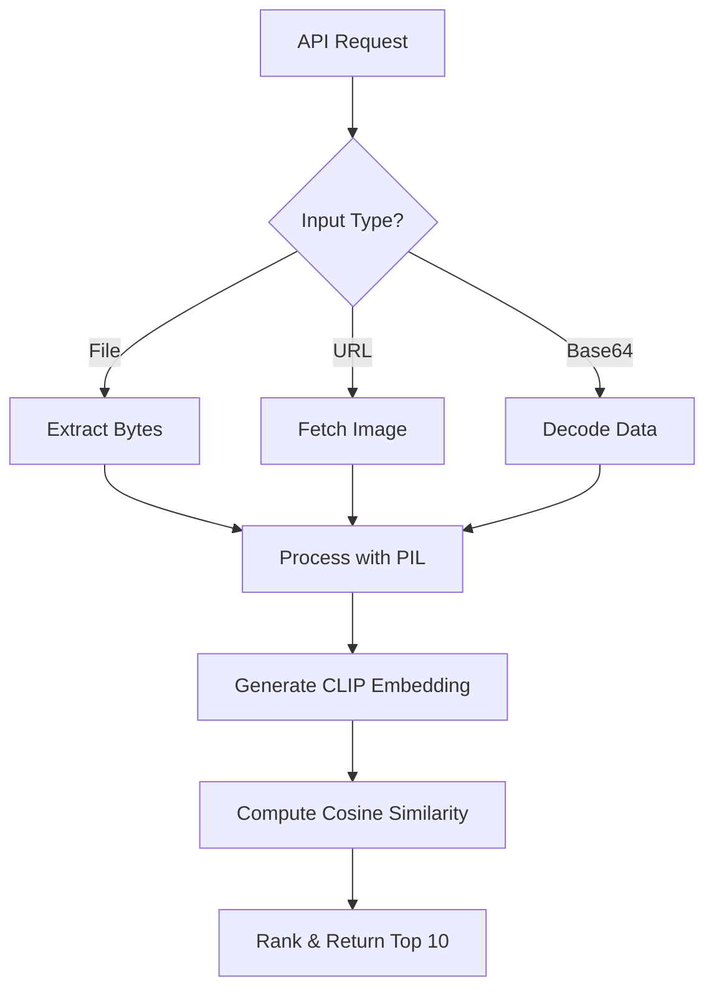

# 🔍 Visual Product Matcher

<div align="center">

**AI-Powered Visual Search for E-commerce and Product Discovery**

[](https://huggingface.co/kumarpiyushraj/spaces)
[](https://huggingface.co/spaces/kumarpiyushraj/visual-product-matcher-frontend)
[](https://huggingface.co/spaces/kumarpiyushraj/visual-product-matcher)

*Upload an image, discover similar products instantly. Powered by CLIP embeddings and modern web technologies.*

[🚀 Try Live Demo](https://huggingface.co/spaces/kumarpiyushraj/visual-product-matcher-frontend) • [📖 View Source](https://huggingface.co/spaces/kumarpiyushraj/visual-product-matcher/tree/main) • [🤝 Contribute](#contributing)

</div>

---

## 📋 Table of Contents

- [Overview](#overview)
- [Key Features](#key-features)
- [Architecture](#architecture)
- [Live Application](#live-application)
- [How It Works](#how-it-works)
- [Technology Stack](#technology-stack)
- [Use Cases](#use-cases)
- [Getting Started](#getting-started)
- [API Documentation](#api-documentation)
- [Performance](#performance)
- [Contributing](#contributing)

---

## 🌟 Overview

**Visual Product Matcher** is a cutting-edge AI-powered visual search tool that revolutionizes product discovery. Whether you're shopping in a store, browsing the web, or managing inventory, simply upload an image to find matching items with remarkable accuracy and speed.

This project demonstrates the power of combining modern frontend technologies with state-of-the-art AI models to create an intuitive, responsive, and production-ready visual search experience.

### Why Visual Product Matcher?

- **🎯 High Accuracy**: Leverages CLIP (Contrastive Language-Image Pre-training) for semantic visual understanding
- **⚡ Lightning Fast**: Precomputed embeddings ensure sub-second query responses
- **🎨 Beautiful UX**: Smooth animations, responsive design, and intuitive interactions
- **🔌 API-Ready**: RESTful endpoints for seamless integration into existing applications
- **🌐 Dual Search Modes**: Store catalog matching AND web reverse image search

---

## ✨ Key Features

### 🏪 Store Discovery Mode
- Upload images or paste URLs to find visually similar products from your catalog
- CLIP-based semantic matching for robust similarity scoring
- Returns top 10 matches with confidence scores
- Handles 50+ products with sub-500ms query times

### 🌍 Web Exploration Mode
- Reverse image search across the internet via Google (SerpAPI)
- Retrieve titles, links, and thumbnails from web results
- Perfect for product research and competitive analysis

### 💻 Modern Frontend
- **Dual Input Methods**: File upload or URL paste with real-time preview
- **Responsive Design**: Adapts beautifully to all devices (mobile, tablet, desktop)
- **Smooth Animations**: Framer Motion-powered transitions and loading states
- **Accessible**: ARIA labels, keyboard navigation, high-contrast modes
- **Error Resilient**: User-friendly error messages and retry prompts

### 🔧 Robust Backend
- **Efficient Processing**: One-time vector generation for instant queries
- **Multiple Input Formats**: Files, URLs, base64 data
- **Scalable Architecture**: Handles up to 10MB files, queued requests
- **Privacy-First**: No persistent data storage, in-memory processing only

---

## 🏗️ Architecture

```
┌─────────────────────────────────────────────────────────────┐
│                     USER INTERFACE                          │
│         (React + Tailwind + Framer Motion)                  │
└────────────────────┬────────────────────────────────────────┘
                     │
                     │ API Requests (JSON)
                     │
┌────────────────────▼────────────────────────────────────────┐
│                  GRADIO BACKEND                             │
│         (Python + CLIP + SerpAPI)                           │
│                                                             │
│  ┌──────────────┐    ┌──────────────┐    ┌─────────────┐    │
│  │ Store Search │    │  Web Search  │    │   Vector    │    │
│  │   Endpoint   │    │   Endpoint   │    │  Database   │    │
│  └──────────────┘    └──────────────┘    └─────────────┘    │
└─────────────────────────────────────────────────────────────┘
         │                     │
         │                     │
    ┌────▼────┐          ┌─────▼──────┐
    │  CLIP   │          │  SerpAPI   │
    │  Model  │          │  (Google)  │
    └─────────┘          └────────────┘
```

### Separation of Concerns
- **Frontend**: Handles UX, user interactions, and API communication
- **Backend**: Manages AI computations, embeddings, and external API calls
- **Deployment**: Both hosted on Hugging Face Spaces for zero-config scaling

---

## 🚀 Live Application

> **Note:** This repository serves as a central hub for the Visual Product Matcher project. The actual code and deployments are hosted on Hugging Face Spaces for optimal performance and collaboration.

### Access the Application

| Component | Purpose | Link |
|-----------|---------|------|
| **Frontend** | Interactive UI for users | [🎨 Launch Frontend](https://huggingface.co/spaces/kumarpiyushraj/visual-product-matcher-frontend) |
| **Backend** | API endpoints & AI processing | [⚙️ View Backend](https://huggingface.co/spaces/kumarpiyushraj/visual-product-matcher) |

### View Source Code

Both repositories contain complete source code with detailed documentation:

1. **Frontend Repository**: Visit the [frontend Space](https://huggingface.co/spaces/kumarpiyushraj/visual-product-matcher-frontend) → Click "Files" tab
2. **Backend Repository**: Visit the [backend Space](https://huggingface.co/spaces/kumarpiyushraj/visual-product-matcher) → Click "Files" tab

You can clone either Space directly from Hugging Face using:
```bash
git clone https://huggingface.co/spaces/kumarpiyushraj/visual-product-matcher-frontend
git clone https://huggingface.co/spaces/kumarpiyushraj/visual-product-matcher
```

---

## 🔬 How It Works

### Frontend Flow


**Key Steps:**
1. **Input Handling**: Captures file uploads or URLs, validates size (<10MB) and format
2. **Preview & Crop**: Real-time preview with optional cropping tools
3. **API Communication**: Sends POST request to backend with base64-encoded image
4. **Results Rendering**: Displays product cards in responsive grid with similarity scores
5. **Interactions**: Modal popups for detailed views, smooth hover effects

**Runtime:** <100ms for validation + 200ms UI updates + backend latency (500ms-3s)

### Backend Flow



**Key Steps:**
1. **Initialization**: Loads CLIP model and precomputed product vectors (512D embeddings)
2. **Image Processing**: Resizes to 320x320, converts to RGB with PIL
3. **Embedding Generation**: Encodes query image using clip-ViT-B-32 model
4. **Similarity Computation**: Calculates cosine similarities against vector database
5. **Results Ranking**: Returns top 10 matches with scores (store) or web results (SerpAPI)

**Runtime:** ~100-500ms per store query | ~1-3s for web search (API latency)

---

## 🛠️ Technology Stack

### Frontend Technologies

| Category | Technology | Purpose |
|----------|-----------|---------|
| **Framework** | React.js | Component-based UI with hooks for state management |
| **Styling** | Tailwind CSS | Utility-first responsive design with custom themes |
| **Animations** | Framer Motion | Smooth transitions, hover effects, loading states |
| **Image Handling** | HTML File API + Fetch | Client-side processing, URL fetching, base64 conversion |
| **API Client** | Fetch API | POST requests to Gradio endpoints with JSON payloads |
| **Notifications** | react-hot-toast | User feedback with toast messages |
| **Deployment** | Hugging Face Spaces | Zero-config static hosting with iframe support |

### Backend Technologies

| Category | Technology | Purpose |
|----------|-----------|---------|
| **Framework** | Gradio 5.49.1 | API serving, UI hosting, request queuing |
| **AI Model** | CLIP (clip-ViT-B-32) | Vision-language model for semantic embeddings (512D) |
| **Image Processing** | Pillow (PIL) | Image opening, resizing, format conversion |
| **Similarity** | Scikit-learn + NumPy | Efficient cosine similarity computations |
| **Web Search** | SerpAPI | Google reverse image search integration |
| **Data Storage** | JSON | Product metadata and precomputed vectors |
| **Environment** | Python + dotenv | Secret management, torch backend (CPU) |

---

## 💼 Use Cases

- **E-commerce**: Help customers find similar products when exact matches are unavailable
- **Inventory Management**: Quickly identify duplicate or similar items in large catalogs
- **Fashion & Retail**: Style-based product recommendations
- **Research & Analysis**: Competitive product discovery and market research
- **Visual Bookmarking**: Save and search products by image across platforms

---

## 🎯 Getting Started

### Try the Live Demo

1. Visit the [Frontend Space](https://huggingface.co/spaces/kumarpiyushraj/visual-product-matcher-frontend)
2. Select **"Store Discovery"** or **"Web Exploration"** tab
3. Upload an image (JPG/PNG/WebP, max 10MB) or paste an image URL
4. Click **"Search"** and view results with similarity scores
5. Click on any result card for detailed view

### Integrate via API

```python
import requests
import base64

# Encode your image
with open("product.jpg", "rb") as f:
    img_base64 = base64.b64encode(f.read()).decode()

# Call store search endpoint
response = requests.post(
    "https://kumarpiyushraj-visual-product-matcher.hf.space/run/store_search",
    json={"data": [{"data": img_base64}, ""]}
)

results = response.json()
print(f"Found {len(results['data'])} matches!")
```

### Embed in Your Website

```html
<iframe 
    src="https://huggingface.co/spaces/kumarpiyushraj/visual-product-matcher-frontend/embed" 
    width="100%" 
    height="600px"
    frameborder="0">
</iframe>
```

---

## 📚 API Documentation

### Store Search Endpoint

**Endpoint:** `POST /run/store_search`

**Request:**
```json
{
  "data": [
    {"data": "base64_encoded_image_or_url"},
    ""
  ]
}
```

**Response:**
```json
{
  "data": [
    {
      "id": "product_001",
      "name": "Blue Denim Jacket",
      "image_url": "/images/jacket.jpg",
      "similarity_score": 0.92
    }
  ]
}
```

### Web Search Endpoint

**Endpoint:** `POST /run/web_search`

**Request:**
```json
{
  "data": ["https://example.com/image.jpg"]
}
```

**Response:**
```json
{
  "data": [
    {
      "title": "Similar Product Name",
      "link": "https://example.com/product",
      "thumbnail": "https://example.com/thumb.jpg"
    }
  ]
}
```

---

## ⚡ Performance

- **Query Speed**: 100-500ms per store search (CPU inference)
- **Scalability**: Handles 50+ products; scales to millions with vector databases
- **Throughput**: Queued requests for concurrent handling
- **File Support**: Up to 10MB images (JPG, PNG, WebP)
- **Accuracy**: CLIP-based semantic matching outperforms pixel-level comparison

### Optimization Tips

✅ Use high-quality, centered images for 20-30% better accuracy  
✅ For web mode, ensure URLs are direct image links (ending in .jpg/.png)  
✅ Consider GPU acceleration for catalogs with 100+ products  
✅ Implement caching for frequently searched images  

---

## 🤝 Contributing

We welcome contributions from the community! Here's how you can help:

### Ways to Contribute

- 🐛 **Report Bugs**: Open an issue on the Hugging Face Space
- 💡 **Suggest Features**: Share ideas for enhancements
- 🔧 **Submit Improvements**: Fork the Space and create a pull request
- 📖 **Improve Documentation**: Help others understand the project better
- 🌍 **Translate**: Add support for more languages

### Development Workflow

1. Visit the [Frontend](https://huggingface.co/spaces/kumarpiyushraj/visual-product-matcher-frontend) or [Backend](https://huggingface.co/spaces/kumarpiyushraj/visual-product-matcher) Space
2. Click "Duplicate Space" to create your own copy
3. Make your changes in the duplicated Space
4. Test thoroughly with various images
5. Submit a pull request with a clear description

### Planned Enhancements

- [ ] Batch image upload support
- [ ] Category and price filters
- [ ] Dark mode toggle
- [ ] PWA for offline mobile use
- [ ] Integration with Pinecone for massive catalogs
- [ ] WebGL-based advanced image previews
- [ ] Video frame extraction for video-based search

---

## 🙏 Acknowledgments

- **Hugging Face** for providing excellent deployment infrastructure
- **OpenAI** for the CLIP model architecture
- **SerpAPI** for reverse image search capabilities
- **Open Source Community** for the amazing tools and libraries

---

## 📧 Contact & Support

- **Questions?** Open a discussion on the [Hugging Face Space](https://huggingface.co/spaces/kumarpiyushraj/visual-product-matcher/discussions)
- **Bug Reports?** Create an issue in the Space repository
- **Feedback?** Use the thumbs up/down buttons in the live demo

---

<div align="center">

**Built with ❤️ for visual explorers**

[⭐ Star this repo](https://github.com/kumarpiyushraj/visual-product-matcher-hf) • [🚀 Try the Demo](https://huggingface.co/spaces/kumarpiyushraj/visual-product-matcher-frontend) • [📖 Read the Docs](https://huggingface.co/spaces/kumarpiyushraj/visual-product-matcher)

*Making product discovery as simple as taking a photo*

</div>

---
<p align="center">
  <sub>© 2025 Kumar Piyush Raj. All rights reserved.</sub>
</p>
