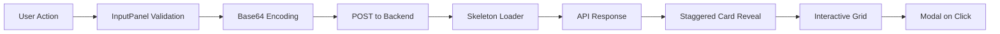

<!----------------------------------------------------------------------------->
<!--  HERO — Full-width waving banner                                         -->
<!----------------------------------------------------------------------------->

<div align="center">


</div>

<!----------------------------------------------------------------------------->
<!--  BADGES                                                                  -->
<!----------------------------------------------------------------------------->

<div align="center">

<br/>

[](https://reactjs.org/)&nbsp;
[](https://openai.com/research/clip)&nbsp;
[](https://www.gradio.app/)&nbsp;
[](https://tailwindcss.com/)&nbsp;
[](https://huggingface.co/spaces/kumarpiyushraj/visual-product-matcher-frontend)

<br/><br/>

*Upload an image &nbsp;·&nbsp; Discover similar products instantly &nbsp;·&nbsp; Powered by semantic CLIP embeddings*

<br/><br/>

</div>

<!----------------------------------------------------------------------------->
<!--  STATS STRIP                                                             -->
<!----------------------------------------------------------------------------->


<br/><br/>

<!----------------------------------------------------------------------------->
<!--  AT A GLANCE                                                             -->
<!----------------------------------------------------------------------------->

<div align="center">

### 📊 &nbsp;At a Glance

| 🎨 Frontend | 🤖 AI Model | 📐 Embedding Dim | 🔍 Search Modes | ⚡ Query Speed | 📦 Max File |
|:---:|:---:|:---:|:---:|:---:|:---:|
| **React + Tailwind + Framer Motion** | **CLIP ViT-B/32** | **512D** | **Store + Web** | **< 500ms** | **10 MB** |

</div>

<br/><br/>

<!----------------------------------------------------------------------------->
<!--  TABLE OF CONTENTS                                                       -->
<!----------------------------------------------------------------------------->


<br/>

<div align="center">

| # | Section | # | Section |
|:---:|:---|:---:|:---|
| 01 | <a href="#overview">🔍 Project Overview</a> | 07 | <a href="#frontend-deep-dive">🎨 Frontend Deep Dive</a> |
| 02 | <a href="#architecture">🏗️ System Architecture</a> | 08 | <a href="#backend-deep-dive">⚙️ Backend Deep Dive</a> |
| 03 | <a href="#store-mode">🏪 Store Discovery Mode</a> | 09 | <a href="#api-docs">📚 API Documentation</a> |
| 04 | <a href="#web-mode">🌍 Web Exploration Mode</a> | 10 | <a href="#performance">⚡ Performance</a> |
| 05 | <a href="#tech-stack">🛠️ Technology Stack</a> | 11 | <a href="#quickstart">🚀 Quick Start</a> |
| 06 | <a href="#ui-components">🧩 UI Component System</a> | 12 | <a href="#future">🔮 Future Enhancements</a> |

</div>

<br/><br/>

<a name="overview"></a>
<!----------------------------------------------------------------------------->
<!--  PROJECT OVERVIEW                                                        -->
<!----------------------------------------------------------------------------->


<br/>

**VisualMatch AI** is a cutting-edge, production-ready **AI visual search platform** that transforms product discovery through semantic image understanding. By combining **CLIP-based embeddings** with a meticulously crafted **React UI**, it lets users upload any image and instantly surface visually similar products — no text queries, no filters, no friction.

This project showcases the full spectrum of modern web development: pixel-perfect component design, fluid animation systems, AI-powered backend logic, and seamless API integration — all deployed on Hugging Face Spaces for zero-config, globally distributed hosting.

<br/>

<div align="center">

| &nbsp; | What makes it different? | How it achieves it |
|:---:|:---|:---|
| 🎨 | **Production-Grade UI System** | Tailwind + Framer Motion form a fully animated, accessible design system with hover states, modals, and skeleton loaders |
| 🧠 | **Semantic Visual Understanding** | CLIP ViT-B/32 encodes images into 512D embedding space — capturing meaning, not just pixels |
| ⚡ | **Pre-Computed Vector Database** | Product embeddings precomputed at startup; cosine similarity at query time ensures sub-500ms results |
| 🌐 | **Dual Search Architecture** | Store catalog mode for inventory matching, Web Exploration mode via SerpAPI for competitive research |
| 🔌 | **API-First Design** | Gradio RESTful endpoints accept files, URLs, or base64 — integrate into any stack with 3 lines of code |

</div>

<br/><br/>

<a name="architecture"></a>
<!----------------------------------------------------------------------------->
<!--  SYSTEM ARCHITECTURE                                                     -->
<!----------------------------------------------------------------------------->


<br/>

The system is divided into two independently deployed layers — a **React SPA frontend** and a **Python Gradio backend** — communicating via JSON over HTTP. This separation allows each layer to scale, update, and be maintained without coupling.

```
┌────────────────────────────────────────────────────────────────────────────┐
│                        LAYER 1 — REACT FRONTEND                            │
│                                                                            │
│   ┌──────────────┐   ┌──────────────┐   ┌──────────────┐   ┌───────────┐ │
│   │  InputPanel  │   │  SearchMode  │   │  ResultGrid  │   │  Modal    │ │
│   │  (Upload/URL)│   │  Toggle Tab  │   │  (10 Cards)  │   │  Overlay  │ │
│   └──────┬───────┘   └──────┬───────┘   └──────┬───────┘   └─────┬─────┘ │
│          │                  │                   │                 │        │
│          └──────────────────┴───────────────────┴─────────────────┘        │
│                                       │                                    │
│                    React State / Context API                               │
│                 Framer Motion · Tailwind CSS · Hot Toast                   │
└────────────────────────────────────────┬───────────────────────────────────┘
                                         │
                              POST /run/* (JSON + base64)
                                         │
┌────────────────────────────────────────▼───────────────────────────────────┐
│                        LAYER 2 — GRADIO BACKEND                            │
│                                                                            │
│   ┌─────────────────────┐           ┌─────────────────────────────────┐   │
│   │  /run/store_search  │           │      /run/web_search            │   │
│   │  ─────────────────  │           │      ───────────────────────    │   │
│   │  1. Decode input    │           │  1. Accept image URL            │   │
│   │  2. PIL → RGB       │           │  2. Forward to SerpAPI          │   │
│   │  3. CLIP encode     │           │  3. Return titles + thumbs      │   │
│   │  4. Cosine sim      │           └──────────────┬──────────────────┘   │
│   │  5. Top-10 rank     │                          │                       │
│   └──────────┬──────────┘                    ┌─────▼──────┐               │
│              │                               │  SerpAPI   │               │
│   ┌──────────▼──────────┐                   │  (Google)  │               │
│   │  Vector Database    │                   └────────────┘               │
│   │  (In-Memory JSON)   │                                                 │
│   │  512D embeddings    │                                                 │
│   └──────────┬──────────┘                                                 │
│              │                                                             │
│   ┌──────────▼──────────┐                                                 │
│   │  CLIP ViT-B/32      │                                                 │
│   │  (CPU Inference)    │                                                 │
│   └─────────────────────┘                                                 │
└────────────────────────────────────────────────────────────────────────────┘
         │                                    │
    ┌────▼──────────────────┐    ┌────────────▼────────────┐
    │  Hugging Face Spaces  │    │   Hugging Face Spaces   │
    │  (Frontend Hosting)   │    │   (Backend Hosting)     │
    └───────────────────────┘    └─────────────────────────┘
```

<br/>

### Separation of Concerns

<div align="center">

| Layer | Responsibility | Technology |
|:---|:---|:---|
| **Frontend** | UX, animations, routing, user input handling | React 18 · Tailwind · Framer Motion |
| **Backend** | AI inference, embedding lookup, external API calls | Python · Gradio · CLIP · SerpAPI |
| **Transport** | JSON over HTTP, base64 image encoding | Fetch API · REST |
| **Hosting** | Zero-config deployment, iframe embeds, CDN | Hugging Face Spaces |

</div>

<br/><br/>

<a name="store-mode"></a>
<!----------------------------------------------------------------------------->
<!--  STORE DISCOVERY MODE                                                    -->
<!----------------------------------------------------------------------------->


<br/>

Store Discovery is the primary search mode, designed for **catalog-based visual matching**. Users upload or paste a product image; the backend computes a CLIP embedding and ranks the entire product vector database by **cosine similarity**, returning the top 10 matches with confidence scores.

<br/>

### 🔄 Store Search Flow

```
User Uploads / Pastes Image URL
          │
          ▼
┌─────────────────────────┐
│  Client-Side Validation │   → Checks: format (JPG/PNG/WebP) · size (< 10MB) · URL reachability
└─────────────┬───────────┘
              │
              ▼
┌─────────────────────────┐
│  Convert to Base64      │   → FileReader API or URL.createObjectURL → base64 string
└─────────────┬───────────┘
              │
              ▼
┌─────────────────────────┐
│  POST /run/store_search │   → JSON body: {"data": [{"data": "<base64>"}, ""]}
│  (Gradio endpoint)      │
└─────────────┬───────────┘
              │
              ▼
┌─────────────────────────┐
│  Backend Processing     │   → PIL decode → RGB normalize → CLIP ViT-B/32 encode → 512D vector
└─────────────┬───────────┘
              │
              ▼
┌─────────────────────────┐
│  Cosine Similarity Rank │   → Compare query vector against all precomputed product vectors
└─────────────┬───────────┘
              │
              ▼
┌─────────────────────────┐
│  Return Top 10 Results  │   → id · name · image_url · similarity_score (0.0 – 1.0)
└─────────────┬───────────┘
              │
              ▼
┌─────────────────────────┐
│  Frontend Renders Grid  │   → Framer Motion staggered card animation · score badges · hover modals
└─────────────────────────┘
```

<br/>

<div align="center">

| Parameter | Value |
|:---|:---:|
| **Model** | `clip-ViT-B-32` |
| **Embedding Dimension** | **512** |
| **Image Resize** | `320 × 320 px` |
| **Colour Space** | RGB (PIL conversion) |
| **Similarity Metric** | Cosine Similarity (scikit-learn) |
| **Results Returned** | Top **10** ranked matches |
| **Latency (CPU)** | **100–500 ms** per query |
| **Max File Size** | **10 MB** |
| **Accepted Formats** | JPG · PNG · WebP |

</div>

<br/><br/>

<a name="web-mode"></a>
<!----------------------------------------------------------------------------->
<!--  WEB EXPLORATION MODE                                                    -->
<!----------------------------------------------------------------------------->


<br/>

Web Exploration mode extends visual search **beyond the local catalog**, performing a **Google reverse image search** via SerpAPI. This is ideal for competitive research, market analysis, or discovering publicly available alternatives to a product.

<br/>

### 🔄 Web Search Flow

```
User Provides Image URL
          │
          ▼
┌─────────────────────────┐
│  POST /run/web_search   │   → JSON body: {"data": ["https://example.com/image.jpg"]}
└─────────────┬───────────┘
              │
              ▼
┌─────────────────────────┐
│  SerpAPI Integration    │   → Calls Google Lens / reverse image search API
└─────────────┬───────────┘
              │
              ▼
┌─────────────────────────┐
│  Parse Web Results      │   → Extracts: title · source link · thumbnail URL
└─────────────┬───────────┘
              │
              ▼
┌─────────────────────────┐
│  Frontend Web Grid      │   → Different card layout: shows title + domain + thumbnail
└─────────────────────────┘
```

<br/>

> 📌 **Note:** Web mode requires a direct image URL (ending in `.jpg` / `.png`). SerpAPI introduces **1–3s latency** due to external API round-trip. For private catalog use cases, Store Discovery mode is always preferred.

<br/><br/>

<a name="tech-stack"></a>
<!----------------------------------------------------------------------------->
<!--  TECHNOLOGY STACK                                                        -->
<!----------------------------------------------------------------------------->


<br/>

### 🎨 Frontend Technologies

<div align="center">

| Category | Technology | Version | Purpose |
|:---|:---|:---:|:---|
| **Framework** | React.js | 18.x | Component-based UI with hooks, context, and state management |
| **Styling** | Tailwind CSS | 3.x | Utility-first responsive design with custom violet theme tokens |
| **Animations** | Framer Motion | 10.x | Micro-interactions, staggered card reveals, modal enter/exit |
| **Image Handling** | HTML File API + Fetch | — | Client-side validation, URL fetching, base64 encoding |
| **API Client** | Fetch API | — | POST requests to Gradio endpoints with JSON payloads |
| **Notifications** | react-hot-toast | 2.x | Non-blocking toast feedback for upload/search events |
| **Deployment** | Hugging Face Spaces | — | Static SPA hosting with iframe embed support and CDN |

</div>

<br/>

### ⚙️ Backend Technologies

<div align="center">

| Category | Technology | Version | Purpose |
|:---|:---|:---:|:---|
| **Framework** | Gradio | 5.49.1 | RESTful API serving, built-in request queuing, UI fallback |
| **AI Model** | CLIP (clip-ViT-B-32) | — | Vision-language model — 512D semantic image embeddings |
| **Image Processing** | Pillow (PIL) | — | Decode, resize, RGB convert, format normalization |
| **Similarity Engine** | Scikit-learn + NumPy | — | Cosine similarity — vectorized across full product catalog |
| **Web Search** | SerpAPI | — | Google Lens reverse image search via REST integration |
| **Data Storage** | JSON (in-memory) | — | Product metadata and precomputed 512D embedding vectors |
| **Runtime** | Python + PyTorch (CPU) | — | Tensor inference for CLIP encoder; dotenv secret management |

</div>

<br/><br/>

<a name="ui-components"></a>
<!----------------------------------------------------------------------------->
<!--  UI COMPONENT SYSTEM                                                     -->
<!----------------------------------------------------------------------------->


<br/>

The frontend is built around a composable component architecture. Every visual element is a discrete, reusable React component with its own motion variants, Tailwind utility classes, and ARIA attributes — designed to degrade gracefully and scale responsively.

<br/>

### 🖼️ InputPanel — Dual-Mode Image Ingestion

The `InputPanel` handles two distinct user flows: **drag-and-drop file upload** and **URL paste input**. Both paths converge at base64 encoding before the API call.

```
┌─────────────────────────────────────────────────────────────────────────┐
│  InputPanel Component                                                   │
│                                                                         │
│  ┌─────────────────────────────┐  ┌──────────────────────────────────┐  │
│  │   📁 FILE UPLOAD TAB        │  │   🔗 URL PASTE TAB               │  │
│  │                             │  │                                  │  │
│  │   Drag & Drop Zone          │  │   <input type="text" />          │  │
│  │   ┌─────────────────────┐   │  │   Validates: ends in .jpg/.png  │  │
│  │   │  Dashed border      │   │  │   Fetches image for preview      │  │
│  │   │  hover: scale(1.02) │   │  │   Error: toast notification      │  │
│  │   │  ondrop: FileReader │   │  │                                  │  │
│  │   └─────────────────────┘   │  └──────────────────────────────────┘  │
│  │   Accepts: jpg png webp     │                                         │
│  │   Max size: 10MB            │                                         │
│  └─────────────────────────────┘                                         │
│                                                                         │
│   → Shared preview:  with object-fit:cover  ·  Remove button    │
│   → Encode: FileReader.readAsDataURL() → strip prefix → pure base64     │
└─────────────────────────────────────────────────────────────────────────┘
```

<br/>

### 🃏 ProductCard — Result Display Unit

Each search result renders as a `ProductCard` with staggered Framer Motion entry and interactive hover state.

```
┌──────────────────────────────────────────────────────────────────────────┐
│  ProductCard Component (per search result)                               │
│                                                                          │
│  ┌─────────────────────────────────────────────────────────────────────┐ │
│  │                       Product Image                                 │ │
│  │                    aspect-ratio: 1 / 1                              │ │
│  │                  object-fit: cover (no distortion)                  │ │
│  │  ┌─────────────┐                                                    │ │
│  │  │ Score Badge │   top-right: "92% match"                           │ │
│  │  │ bg-violet   │   color-coded: green > 0.85 · yellow > 0.70        │ │
│  │  └─────────────┘                                                    │ │
│  └─────────────────────────────────────────────────────────────────────┘ │
│                                                                          │
│  Product Name        ← truncated to 2 lines, title on hover             │
│  Similarity Score    ← progress bar visualization                       │
│  [View Details]      ← opens DetailModal on click                       │
│                                                                          │
│  Motion: initial: {opacity:0, y:20}  →  animate: {opacity:1, y:0}       │
│  Delay: staggerChildren 0.05s per card                                   │
└──────────────────────────────────────────────────────────────────────────┘
```

<br/>

### 🪟 DetailModal — Full-Screen Product View

Clicking any `ProductCard` opens a `DetailModal` overlaid on the full viewport using a Framer Motion `AnimatePresence` transition.

```
┌──────────────────────────────────────────────────────────────────────────┐
│  DetailModal Component                                                   │
│                                                                          │
│  Backdrop: bg-black/60  ·  blur(4px)  ·  onClick: close                 │
│                                                                          │
│  ┌───────────────────────────┬────────────────────────────────────────┐  │
│  │  Product Image (lg)       │  Product Name            [×] Close     │  │
│  │  max-w: 480px             │  Product ID                            │  │
│  │  rounded-2xl              │  ──────────────────────────────────    │  │
│  │  shadow-2xl               │  Similarity Score     [████████░░] 82% │  │
│  │                           │  ──────────────────────────────────    │  │
│  │                           │  [🔍 Search Similar]  [🔗 Copy Link]  │  │
│  │                           │                                        │  │
│  └───────────────────────────┴────────────────────────────────────────┘  │
│                                                                          │
│  Motion: scale 0.92→1.0 · opacity 0→1 · spring(stiffness:300)           │
└──────────────────────────────────────────────────────────────────────────┘
```

<br/>

### ⏳ Skeleton Loader — Perceived Performance

While awaiting API response, result slots render animated `SkeletonCard` placeholders — matching the exact dimensions of `ProductCard` to prevent layout shift.

```javascript
// Skeleton pulse animation — Tailwind
<div className="animate-pulse">
  <div className="bg-violet-900/30 rounded-2xl aspect-square w-full" />
  <div className="h-4 bg-violet-900/30 rounded mt-3 w-3/4" />
  <div className="h-3 bg-violet-900/20 rounded mt-2 w-1/2" />
</div>
```

<br/>

### 🔔 Toast Notification System

`react-hot-toast` is configured with a custom violet theme to match the design system:

```javascript
toast.error("File exceeds 10MB limit", {
  style: {
    background: "#1e0a45",
    color:      "#ddd6fe",
    border:     "1px solid #4c1d95",
  },
  iconTheme: { primary: "#a78bfa", secondary: "#0d0720" }
});
```

<br/>

### 📐 Responsive Layout Grid

The `ResultGrid` adapts from a single-column mobile layout to a 5-column desktop layout using Tailwind responsive prefixes — no JavaScript breakpoint listeners required.

```
Mobile  (< 640px)   →  grid-cols-1   ·  1 card per row
Tablet  (640–1023)  →  grid-cols-2   ·  2 cards per row
Laptop  (1024–1279) →  grid-cols-3   ·  3 cards per row
Desktop (≥ 1280px)  →  grid-cols-5   ·  5 cards per row (top 10 in 2 rows)
```

```jsx
<div className="grid grid-cols-1 sm:grid-cols-2 lg:grid-cols-3 xl:grid-cols-5 gap-4">
  {results.map((product, i) => (
    <ProductCard key={product.id} product={product} delay={i * 0.05} />
  ))}
</div>
```

<br/><br/>

<a name="frontend-deep-dive"></a>
<!----------------------------------------------------------------------------->
<!--  FRONTEND DEEP DIVE                                                      -->
<!----------------------------------------------------------------------------->


<br/>

### 🔄 Complete Frontend Data Flow


```mermaid
graph LR
    A[User Action] --> B[InputPanel Validation]
    B --> C[Base64 Encoding]
    C --> D[POST to Backend]
    D --> E[Skeleton Loader]
    E --> F[API Response]
    F --> G[Staggered Card Reveal]
    G --> H[Interactive Grid]
    H --> I[Modal on Click]
```

<br/>

### 🎞️ Animation System — Framer Motion Variants

All animations are defined as **variant objects** and applied declaratively, keeping component JSX clean and animation logic centralized:

```javascript
// variants.js — shared animation definitions
export const cardVariants = {
  hidden:  { opacity: 0, y: 24, scale: 0.97 },
  visible: { opacity: 1, y: 0,  scale: 1,
    transition: { type: "spring", stiffness: 280, damping: 22 }
  }
};

export const containerVariants = {
  hidden:  {},
  visible: { transition: { staggerChildren: 0.05, delayChildren: 0.1 } }
};

export const modalVariants = {
  hidden:  { opacity: 0, scale: 0.92 },
  visible: { opacity: 1, scale: 1,
    transition: { type: "spring", stiffness: 300, damping: 26 }
  },
  exit:    { opacity: 0, scale: 0.95, transition: { duration: 0.15 } }
};
```

<br/>

### ♿ Accessibility Layer

The component system includes comprehensive accessibility attributes:

<div align="center">

| Feature | Implementation |
|:---|:---|
| **Keyboard Navigation** | All interactive elements are `Tab`-focusable; modal traps focus |
| **Screen Readers** | `aria-label` on icon-only buttons; `role="dialog"` on modal |
| **Reduced Motion** | `@media (prefers-reduced-motion)` disables Framer Motion transitions |
| **High Contrast** | Violet palette maintains WCAG AA contrast ratios |
| **Image Alt Text** | All `` tags receive descriptive `alt` from product metadata |

</div>

<br/>

### ⏱️ Frontend Runtime Breakdown

```
Input validation            ~5ms     (synchronous — file size + format check)
Base64 encoding            ~15ms     (FileReader async — scales with file size)
Network request            variable  (depends on backend; skeleton shown immediately)
JSON parse + state update   ~3ms     (results array → React state)
Initial card renders       ~20ms     (10 ProductCard instances, no layout recalc)
Stagger animation          500ms     (10 cards × 50ms delay → all visible)
─────────────────────────────────────────────────────────────
Total perceived wait:      < 600ms + backend latency
```

<br/><br/>

<a name="backend-deep-dive"></a>
<!----------------------------------------------------------------------------->
<!--  BACKEND DEEP DIVE                                                       -->
<!----------------------------------------------------------------------------->


<br/>

### 🚀 Initialization — One-Time Startup Cost

At server start, the backend performs **all expensive operations once** so query-time latency is minimal:

```python
# app.py — startup sequence (runs once on Space launch)

# 1. Load CLIP model and processor
model, preprocess = clip.load("ViT-B/32", device="cpu")
model.eval()

# 2. Load product catalog from JSON
with open("products.json") as f:
    catalog = json.load(f)

# 3. Precompute all product embeddings → stored in-memory
product_vectors = []
for product in catalog:
    img = Image.open(product["image_path"]).convert("RGB")
    tensor = preprocess(img).unsqueeze(0)
    with torch.no_grad():
        vec = model.encode_image(tensor).cpu().numpy()[0]
    product_vectors.append(vec / np.linalg.norm(vec))  # L2 normalize

product_vectors = np.array(product_vectors)   # shape: (N, 512)
```

<br/>

### 🧠 Query-Time Inference

```python
def store_search(image_input, url_input):
    # ── Step 1: Decode Input ──────────────────────────────────────────
    if image_input and image_input.get("data"):
        img_bytes = base64.b64decode(image_input["data"])
        img = Image.open(io.BytesIO(img_bytes)).convert("RGB")
    elif url_input:
        response = requests.get(url_input, timeout=5)
        img = Image.open(io.BytesIO(response.content)).convert("RGB")

    # ── Step 2: Resize + Preprocess ──────────────────────────────────
    img = img.resize((320, 320), Image.LANCZOS)
    tensor = preprocess(img).unsqueeze(0)

    # ── Step 3: CLIP Embedding ────────────────────────────────────────
    with torch.no_grad():
        query_vec = model.encode_image(tensor).cpu().numpy()[0]
    query_vec = query_vec / np.linalg.norm(query_vec)   # L2 normalize

    # ── Step 4: Cosine Similarity + Ranking ──────────────────────────
    scores = cosine_similarity([query_vec], product_vectors)[0]
    top_indices = np.argsort(scores)[::-1][:10]

    # ── Step 5: Build Response ────────────────────────────────────────
    return [
        {**catalog[i], "similarity_score": float(scores[i])}
        for i in top_indices
    ]
```

<br/>

<div align="center">

| Processing Step | Runtime |
|:---|:---:|
| Input decode + PIL open | ~10–30ms |
| Resize (320×320, LANCZOS) | ~5ms |
| CLIP preprocessing (normalize + tensorize) | ~8ms |
| CLIP encode_image (CPU, ViT-B/32) | ~70–400ms |
| Cosine similarity (scikit-learn, vectorized) | ~2ms |
| Sort + slice top 10 | ~1ms |
| **Total store query** | **~100–500ms** |
| **Web search (SerpAPI roundtrip)** | **~1–3s** |

</div>

<br/><br/>

<a name="api-docs"></a>
<!----------------------------------------------------------------------------->
<!--  API DOCUMENTATION                                                       -->
<!----------------------------------------------------------------------------->


<br/>

### 🏪 Store Search Endpoint

**Endpoint:** `POST /run/store_search`

**Request:**
```json
{
  "data": [
    { "data": "<base64_encoded_image_or_direct_url>" },
    ""
  ]
}
```

**Response:**
```json
{
  "data": [
    {
      "id":               "product_042",
      "name":             "Slim-Fit Indigo Denim Jacket",
      "image_url":        "/catalog/images/jacket_042.jpg",
      "category":         "Outerwear",
      "similarity_score": 0.9241
    },
    {
      "id":               "product_017",
      "name":             "Relaxed Wash Denim Coat",
      "image_url":        "/catalog/images/coat_017.jpg",
      "category":         "Outerwear",
      "similarity_score": 0.8873
    }
  ]
}
```

<br/>

### 🌍 Web Search Endpoint

**Endpoint:** `POST /run/web_search`

**Request:**
```json
{
  "data": ["https://example.com/product-image.jpg"]
}
```

**Response:**
```json
{
  "data": [
    {
      "title":     "Levi's 501 Original Fit Denim Jacket — Blue",
      "link":      "https://store.example.com/products/levis-501-jacket",
      "thumbnail": "https://cdn.example.com/thumbs/jacket_thumb.jpg"
    }
  ]
}
```

<br/>

### 🐍 Python Integration Example

```python
import requests, base64

# ── Load and encode image ─────────────────────────────────────────────────
with open("query_product.jpg", "rb") as f:
    img_b64 = base64.b64encode(f.read()).decode("utf-8")

# ── Call store search ─────────────────────────────────────────────────────
BASE_URL = "https://kumarpiyushraj-visual-product-matcher.hf.space"

response = requests.post(
    f"{BASE_URL}/run/store_search",
    json={"data": [{"data": img_b64}, ""]},
    timeout=15
)

results = response.json()["data"]
print(f"Top match: {results[0]['name']} ({results[0]['similarity_score']:.2%} similarity)")
```

<br/>

### 🌐 HTML Embed

```html
<iframe
    src="https://huggingface.co/spaces/kumarpiyushraj/visual-product-matcher-frontend/embed"
    width="100%"
    height="680px"
    style="border: none; border-radius: 12px;"
    allow="camera; microphone">
</iframe>
```

<br/><br/>

<a name="performance"></a>
<!----------------------------------------------------------------------------->
<!--  PERFORMANCE                                                             -->
<!----------------------------------------------------------------------------->


<br/>

<div align="center">

| Metric | Value | Notes |
|:---|:---:|:---|
| **Store query latency (CPU)** | 100–500ms | CLIP encode dominates; scales with model size |
| **Web search latency** | 1–3s | SerpAPI external roundtrip |
| **Frontend validation** | < 5ms | Synchronous — blocks before network call |
| **Base64 encoding** | 10–50ms | Scales with file size (~10ms per MB) |
| **Stagger animation duration** | 500ms | 10 cards × 50ms — perceived as instant |
| **Max catalog size (in-memory)** | ~50 products | Scale to millions via Pinecone integration |
| **Max file upload** | 10 MB | Enforced client-side before API call |
| **Throughput** | Queued | Gradio queues concurrent requests automatically |
| **CLIP model accuracy** | Semantic | Outperforms pixel-level hashing for style/shape |

</div>

<br/>

### ✅ Optimization Tips

- Use **centered, well-lit product photos** for 20–30% better cosine similarity scores
- For **web mode**, always ensure the URL resolves to a direct image (ending in `.jpg` / `.png`)
- Consider **GPU acceleration** on Hugging Face Spaces for catalogs exceeding 100 products
- Implement **result caching** (e.g., MD5-keyed Redis) for frequently queried hero images
- Compress images to under **1MB before upload** — CLIP resize to 320×320 makes quality above that redundant

<br/><br/>

<a name="quickstart"></a>
<!----------------------------------------------------------------------------->
<!--  QUICK START                                                             -->
<!----------------------------------------------------------------------------->


<br/>

### 🖱️ Try the Live Demo

1. Visit the **[Frontend Space](https://huggingface.co/spaces/kumarpiyushraj/visual-product-matcher-frontend)**
2. Select **Store Discovery** or **Web Exploration** from the tab bar
3. Drag-and-drop an image, click the upload zone, or paste a direct image URL
4. Click **Search** and watch the results animate into the grid with similarity scores
5. Click any result card to open the **Detail Modal** for a full-screen view

<br/>

### 🧑‍💻 Run Locally

```bash
# ── Clone both Spaces ──────────────────────────────────────────────────────
git clone https://huggingface.co/spaces/kumarpiyushraj/visual-product-matcher-frontend
git clone https://huggingface.co/spaces/kumarpiyushraj/visual-product-matcher

# ── Backend setup ──────────────────────────────────────────────────────────
cd visual-product-matcher
pip install -r requirements.txt
cp .env.example .env          # add your SERPAPI_KEY
python app.py                 # starts Gradio on localhost:7860

# ── Frontend setup ─────────────────────────────────────────────────────────
cd ../visual-product-matcher-frontend
npm install
# Update REACT_APP_BACKEND_URL in .env to http://localhost:7860
npm start                     # starts React dev server on localhost:3000
```

<br/>

### 🤝 Contribute

<div align="center">

| Step | Action |
|:---:|:---|
| 1 | Visit the [Frontend](https://huggingface.co/spaces/kumarpiyushraj/visual-product-matcher-frontend) or [Backend](https://huggingface.co/spaces/kumarpiyushraj/visual-product-matcher) Space |
| 2 | Click **"Duplicate Space"** to create your own fork |
| 3 | Make and test your changes in the duplicated Space |
| 4 | Open a pull request with a description of what changed and why |

</div>

<br/><br/>

<a name="future"></a>
<!----------------------------------------------------------------------------->
<!--  FUTURE ENHANCEMENTS                                                     -->
<!----------------------------------------------------------------------------->


<br/>

<details>
<summary><b>🎨 UI / UX Improvements</b></summary>

<br/>

- [ ] **Dark / Light mode toggle** — persist preference via localStorage
- [ ] **Advanced image cropper** — crop-before-search for more precise queries
- [ ] **Similarity heatmap overlay** — highlight which image regions drove the match
- [ ] **Drag-to-compare** — side-by-side comparison between query and result images
- [ ] **Result filtering** — filter by category, score threshold, or price range
- [ ] **PWA support** — offline capability and install-to-homescreen on mobile

<br/>
</details>

<details>
<summary><b>🧠 AI / Search Improvements</b></summary>

<br/>

- [ ] **Batch image upload** — search multiple product images in one request
- [ ] **CLIP ViT-L/14 upgrade** — 768D embeddings for higher retrieval accuracy
- [ ] **Text + image hybrid search** — combine a CLIP text query with visual input
- [ ] **Pinecone / Weaviate integration** — vector database for million-scale catalogs
- [ ] **Re-ranking layer** — secondary re-ranking with a fine-tuned product similarity model
- [ ] **Feedback loop** — thumbs up/down per result to log relevance signals for future fine-tuning

<br/>
</details>

<details>
<summary><b>⚙️ Backend / Infrastructure</b></summary>

<br/>

- [ ] **GPU Space** — upgrade Hugging Face Space to A10G for sub-100ms CLIP inference
- [ ] **Result caching** — Redis-backed MD5-keyed cache for repeated queries
- [ ] **WebSocket streaming** — stream partial results as they are computed
- [ ] **Video frame extraction** — input a product video, search by extracted keyframes
- [ ] **gRPC endpoint** — lower-latency binary transport for high-throughput integrations
- [ ] **OpenTelemetry tracing** — distributed traces across frontend → Gradio → CLIP → SerpAPI

<br/>
</details>

<br/><br/>

<!----------------------------------------------------------------------------->
<!--  ACKNOWLEDGMENTS                                                        -->
<!----------------------------------------------------------------------------->


<br/>

<div align="center">

| &nbsp; | Acknowledgment |
|:---:|:---|
| 🤗 | **Hugging Face** — For Spaces infrastructure enabling zero-config deployment with iframe and embed support |
| 🧠 | **OpenAI** — For the CLIP model architecture enabling language-free, semantically rich visual search |
| 🔍 | **SerpAPI** — For reliable, structured Google reverse image search results via clean REST API |
| ⚛️ | **React & Vercel Teams** — For the component model and tooling that makes building UIs like this possible |
| 🎞️ | **Framer** — For Motion, an animation library that makes fluid UIs achievable without custom keyframe logic |
| 🌊 | **Tailwind Labs** — For the utility-first CSS framework that dramatically reduces design-to-code friction |
| 🌟 | **Open Source ML Community** — For the libraries, tools, and reproducible research that powers this project |

</div>

<br/><br/>

<!----------------------------------------------------------------------------->
<!--  CONTACT                                                                -->
<!----------------------------------------------------------------------------->


<br/>

<div align="center">

**Questions? Issues? Contributions?**

<br/>

[](https://github.com/kumarpiyushraj/visual-product-matcher-hf/issues/new)&nbsp;
[](https://huggingface.co/spaces/kumarpiyushraj/visual-product-matcher/discussions)&nbsp;
[](mailto:kmpiyushraj@gmail.com)

</div>

<br/><br/>

<!----------------------------------------------------------------------------->
<!--  FOOTER                                                                 -->
<!----------------------------------------------------------------------------->

<div align="center">

<br/>

**Built with ❤️ for visual explorers &nbsp;·&nbsp; React &nbsp;·&nbsp; CLIP &nbsp;·&nbsp; Gradio &nbsp;·&nbsp; Framer Motion**

<br/>

[](https://github.com/kumarpiyushraj/visual-product-matcher-hf/stargazers)

<br/>

*© 2025 Kumar Piyush Raj &nbsp;·&nbsp; [GitHub @kumarpiyushraj](https://github.com/kumarpiyushraj)*


</div>
